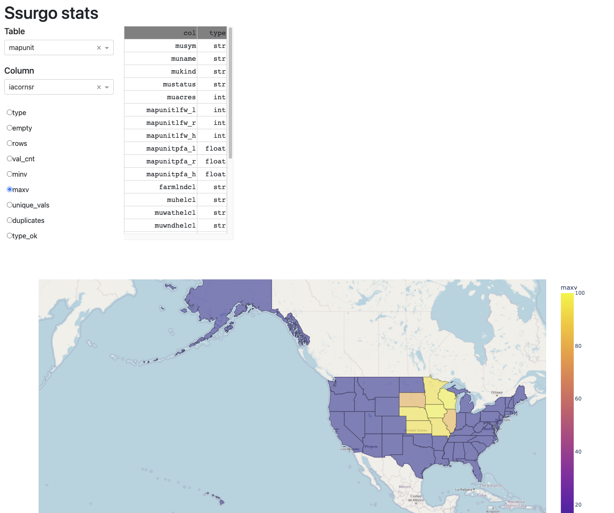

# Soil Data Stats

Statistics are calculated for data downloaded 06-12-2022 and can be found in file
report.csv and report\_uv.csv

## Run with docker
### Requirements
- Docker
- docker-compose
- HDD ~50GB    


### Download states data to disk
Create virtualenv

Install requirements:
```shell
pip install -r requirements_proc.txt
```  

Download all data
```shell
python downloader.py
```  

generate stats
```shell
python proces_stats.py.py
```  


## Presentation of statistics
```shell
docker-compose up -d --build 
```  

## Usage
visit https://localhost:8050/

You can see stats for each column:
- type - type of column [str, int, float]
- empty - in which states there is no values in this column
- rows - total row count per state
- val\_cnt - count not empty occurance
- minv - min value for int, float column
- maxv - max value for int, float column
- unique\_vals - how many unique values are in this column
- duplicates - is there are any duplicates per state
- type\_ok - can values from this column can be easily cast to db schema



